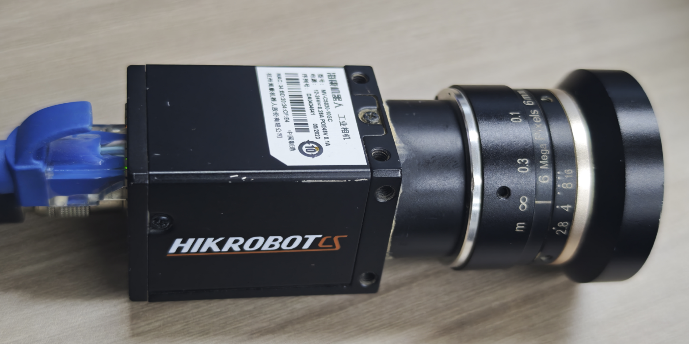
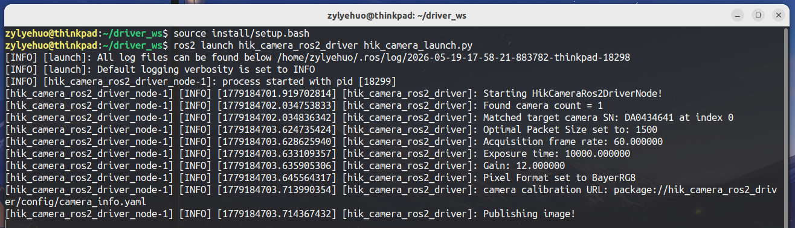
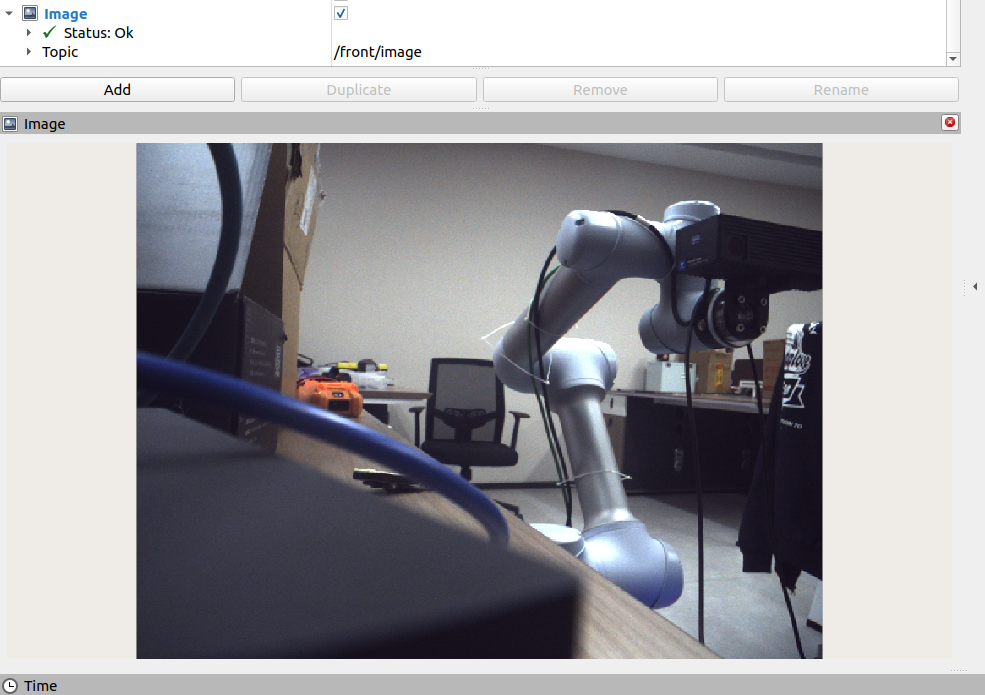

# 🚀 海康相机 ROS 2 驱动 (hik_camera_ros2_driver) 优化

> 本项目基于原版的 ROS 2 海康相机驱动进行了深度重构与优化。主要解决了原版驱动在多设备部署时“依赖环境复杂”、“容易找不到相机”、“异常退出时引发节点崩溃”以及“编译构建失败”等痛点问题。







> 以下是本次升级的核心改善项总结：

## 1. 实现“免安装” (Portable Driver)
**🔴 原版痛点：**
原版代码严重依赖海康 MVS 官方软件的全局安装路径（`/opt/MVS`）。换一台没有安装 MVS 客户端的电脑，或者在新开的终端中忘记手动执行 `export` 环境变量命令，节点就会因为底层找不到驱动而疯狂报错 `No camera found`。

**🟢 优化措施：**
* **本地化动态库闭环：** 将 MVS 底层通信所需的完整依赖（包括 `MvProducerGEV.cti` 核心网口发现驱动、GenICam 隐藏动态库组、以及负责图像像素转换的 `ThirdParty` 库集合）全部打包进代码工作空间的 `amd64` 目录下。
* **Launch 文件动态注入：** 重写了 `hik_camera_launch.py`，利用 Python 在节点启动前自动解析工作空间的 `install/lib` 路径，并动态拼接到 `GENICAM_GENTL64_PATH` 和 `LD_LIBRARY_PATH` 环境变量中。
* **💡 最终效果：** **即插即用**。只需执行 `source install/setup.bash` 即可连上相机，无需任何额外配置。

## 2. 修复生命周期管理导致的节点崩溃 (Crash Fix)
**🔴 原版痛点：**
在原版 `hik_camera_node.cpp` 的构造函数中，如果相机未连接或网络配置不对导致 `initializeCamera()` 失败并陷入重试循环，此时用户按下 `Ctrl+C` 强行终止程序，代码会带着一个空的相机句柄（`nullptr`）继续往下执行 `declareParameters()`。这会导致底层向 ROS 2 核心抛出越界异常（`InvalidParameterValueException`），节点以非正常的退出码（Exit code -6）死机崩溃。

**🟢 优化措施：**
引入了严格的**安全熔断机制**。
```cpp
// 优化后的构造函数逻辑
if (!initializeCamera()) {
  RCLCPP_ERROR(this->get_logger(), "Failed to initialize camera! Node will shut down safely.");
  rclcpp::shutdown();
  return;  // 拦截执行，安全退出
}
declareParameters();
startCamera();
```
* **💡 最终效果：** 当遇到设备离线、网络异常或用户主动打断（`Ctrl+C`）时，节点安全地释放资源并退出，提升了工程的健壮性。

## 3. 补全图像格式转换核心库 (ThirdParty 补充)
**🔴 原版痛点：**
原版在提取动态库时，往往只提取了顶层的 `libMvCameraControl.so` 等几项，遗漏了深层依赖的 `ThirdParty` 目录。这导致相机在需要将底层的 Bayer 格式通过 CPU 转换为 ROS 2 标准的 `RGB8` 图像格式时，因缺失底层多媒体库（FFmpeg 相关的 `libavutil` 等）而转换失败或直接段错误。

**🟢 优化措施：**
* 完整克隆并保留了 `ThirdParty` 目录结构，并在 `launch` 文件中将 `ThirdParty` 的路径一并加入了 `LD_LIBRARY_PATH` 环境变量监测树中。
* **💡 最终效果：** 图像像素格式的转换（ConvertPixelType）稳定运行。

***

